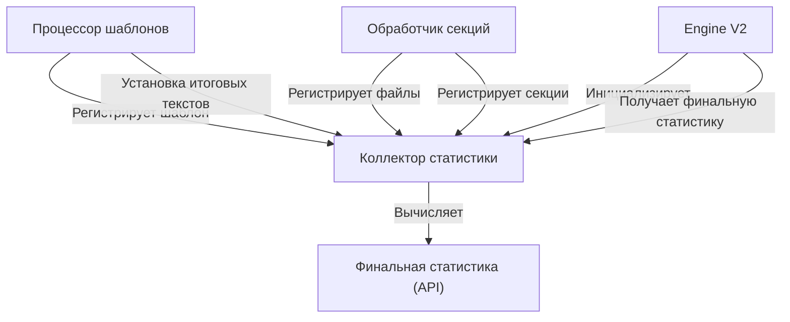

# LG V2 и новый движок шаблонизации

Анализируя требования по необходимости реализации новых блоков в шаблонах: условных и режимов, учитывая уже существующую логику прейсхолдеров с рекурсивными инклудами и предвосхищая новые потенциальные требования, связанные с системой шаблонов — я пришел к выводу о том, что нам необходимо разработать новый движок шаблонов и полностью переработать центральную часть пайплайна LG, которая будет использовать новую подсистему шаблонов. По сути это означает глобальный выпуск мажорной версии LG V2.

## Мы отказываемся от

1. Старый модуль `lg/context/`. Он не перспективен, основан на простой подстановке плейсхолдеров (`${section_name}`) и не поддерживает условные блоки или переопределение режимов. 

2. Центральная часть пайплайна в `lg/engine.py`.

```
resolve_context  → build_manifest → build_plan → process_groups → render_by_section → compose_context 
```

Основная проблема в том, что обработка шаблонов сейчас происходит в двух отдельных фазах:

- В `resolve_context` - собираются ссылки на секции из плейсхолдеров
- В `compose_context` - выполняется подстановка уже отрендеренных секций

А между этими фазами выполняется вся тяжелая работа по обработке файлов.

3. Старая система IR-классов в `lg/types.py`. Так как мы собираемся значительно переработать пайплайн, то от старой декларации IR-модели лучше тоже сразу отказаться и начать разработку более чистой подходящей версии.

4. Старая система статистики в `lg/stats/report.py`.

## Что мы планируем на замену

- **Новый единый движок шаблонизации**
- **Новая версия центрального пайплайна обработки LG V2**
- **Новая последовательность обработки секций**
- **Новая конфигурация и модель для адаптивных возможностей**
- **Новая IR-модель**
- **Новая инкрементальная система статистики**

## Адаптация системы статистики для архитектуры LG V2

Система статистики - один из ключевых компонентов Listing Generator, который нужно аккуратно переработать для новой архитектуры V2. Вместо постобработки статистики после завершения пайплайна, в новой архитектуре нам нужно собирать метрики инкрементально в процессе рендеринга.

### Основные изменения в подходе к сбору статистики

В текущей архитектуре статистика собирается одним большим вызовом `compute_stats()` после того, как весь пайплайн завершён:

```python
def compute_stats(
    *,
    blobs: List[ProcessedBlob],
    rendered_final_text: str,
    rendered_sections_only_text: str,
    templates_hashes: Dict[str, str],
    spec: ContextSpec,
    manifest: Manifest,
    tokenizer: TokenService,
    code_fence: bool,
    cache: Cache,
) -> Tuple[List[FileRow], Totals, ContextBlock]:
    # ...
```

В новой архитектуре V2 нам нужно:

1. Собирать статистику постепенно, по мере обработки файлов и секций
2. Учитывать динамически изменяющийся контекст (режимы, теги)
3. Корректно обрабатывать условные блоки
4. Отслеживать переопределения режимов через `` блоки

### Новая модель сбора статистики

#### Коллектор статистики

```python
class StatsCollector:
    """
    Коллектор статистики, встроенный в процесс рендеринга шаблонов.
    
    Собирает метрики инкрементально, по мере обработки шаблонов и секций.
    """
    
    def __init__(self, run_ctx: RunContext):
        self.run_ctx = run_ctx
        self.tokenizer = run_ctx.tokenizer
        self.cache = run_ctx.cache
        self.model_info = self.tokenizer.model_info
        
        # Статистика по файлам (ключ: rel_path)
        self.files_stats: Dict[str, FileStats] = {}
        
        # Статистика по секциям (ключ: canon_key)
        self.sections_stats: Dict[str, SectionStats] = {}
        
        # Статистика по шаблонам (ключ: template_key)
        self.templates_stats: Dict[str, TemplateStats] = {}
        
        # Итоговый текст и связанные метрики
        self.final_text: Optional[str] = None
        self.sections_only_text: Optional[str] = None
        
        # Карта использования секций {canon_key: count}
        self.sections_usage: Dict[str, int] = {}
        
    def register_processed_file(self, file: ProcessedFile, section_ref: SectionRef, multiplicity: int = 1) -> None:
        """Регистрирует статистику обработанного файла."""
        rel_path = file.rel_path
        
        # Получаем или подсчитываем токены
        t_proc = self._get_or_count_tokens(
            file.cache_key, "processed", file.processed_text
        )
        
        t_raw = self._get_or_count_tokens(
            file.cache_key, "raw", file.raw_text
        )
        
        # Статистика файла с учетом множественности
        saved_tokens = max(0, (t_raw - t_proc) * multiplicity)
        saved_pct = (1 - (t_proc / t_raw)) * 100.0 if t_raw else 0.0
        
        # Регистрируем или обновляем статистику файла
        if rel_path not in self.files_stats:
            self.files_stats[rel_path] = FileStats(
                path=rel_path,
                size_bytes=file.size_bytes,
                tokens_raw=t_raw * multiplicity,
                tokens_processed=t_proc * multiplicity,
                saved_tokens=saved_tokens,
                saved_pct=saved_pct,
                meta=file.meta,
                sections={section_ref.canon_key(): multiplicity}
            )
        else:
            # Файл уже учтен, обновляем статистику использования
            stats = self.files_stats[rel_path]
            canon_key = section_ref.canon_key()
            stats.sections[canon_key] = stats.sections.get(canon_key, 0) + multiplicity
        
        # Обновляем счетчик использования секции
        self.sections_usage[section_ref.canon_key()] = self.sections_usage.get(
            section_ref.canon_key(), 0
        ) + multiplicity
    
    def register_section_rendered(self, section: RenderedSection) -> None:
        """Регистрирует статистику отрендеренной секции."""
        canon_key = section.ref.canon_key()
        
        # Собираем метаданные со всех файлов
        meta_summary = {}
        for file in section.files:
            for k, v in self._extract_numeric_meta(file.meta).items():
                meta_summary[k] = meta_summary.get(k, 0) + v
        
        # Регистрируем статистику секции
        self.sections_stats[canon_key] = SectionStats(
            ref=section.ref,
            text=section.text,
            tokens_processed=section.tokens_processed,
            tokens_raw=section.tokens_raw,
            total_size_bytes=section.total_size_bytes,
            meta_summary=meta_summary
        )
    
    def set_final_texts(self, final_text: str, sections_only_text: str) -> None:
        """Устанавливает итоговые тексты для подсчета токенов."""
        self.final_text = final_text
        self.sections_only_text = sections_only_text
    
    def register_template(self, template_key: str, template_text: str) -> None:
        """Регистрирует статистику шаблона."""
        # Подсчитываем токены в шаблоне
        tokens = self.tokenizer.count_text(template_text)
        
        self.templates_stats[template_key] = TemplateStats(
            key=template_key,
            tokens=tokens,
            text_size=len(template_text)
        )
    
    def compute_final_stats(self) -> Tuple[List[FileRow], Totals, ContextBlock]:
        """
        Вычисляет итоговую статистику на основе собранных данных.
        
        Возвращает структуру, аналогичную старой compute_stats():
        - список статистики по файлам
        - общую статистику
        - статистику контекста
        """
        # Проверяем наличие необходимых данных
        if not self.final_text:
            raise ValueError("Final text not set. Call set_final_texts() before computing stats.")
        
        # Вычисляем общие суммы
        total_raw = sum(f.tokens_raw for f in self.files_stats.values())
        total_proc = sum(f.tokens_processed for f in self.files_stats.values())
        total_size = sum(f.size_bytes for f in self.files_stats.values())
        
        # Подсчитываем токены в итоговом тексте
        t_final = self._get_or_count_tokens("final_text", "rendered", self.final_text)
        t_sections_only = self._get_or_count_tokens("sections_only", "rendered", self.sections_only_text)
        
        # Преобразуем статистику файлов в формат API
        files_rows = []
        for file_stats in sorted(self.files_stats.values(), key=lambda x: x.path):
            prompt_share = (file_stats.tokens_processed / total_proc * 100.0) if total_proc else 0.0
            ctx_share = (file_stats.tokens_processed / self.model_info.ctx_limit * 100.0) if self.model_info.ctx_limit else 0.0
            
            files_rows.append(FileRow(
                path=file_stats.path,
                sizeBytes=file_stats.size_bytes,
                tokensRaw=file_stats.tokens_raw,
                tokensProcessed=file_stats.tokens_processed,
                savedTokens=file_stats.saved_tokens,
                savedPct=file_stats.saved_pct,
                promptShare=prompt_share,
                ctxShare=ctx_share,
                meta=file_stats.meta or {}
            ))
        
        # Создаем итоговую статистику
        totals = Totals(
            sizeBytes=total_size,
            tokensProcessed=total_proc,
            tokensRaw=total_raw,
            savedTokens=max(0, total_raw - total_proc),
            savedPct=(1 - (total_proc / total_raw)) * 100.0 if total_raw else 0.0,
            ctxShare=(total_proc / self.model_info.ctx_limit * 100.0) if self.model_info.ctx_limit else 0.0,
            renderedTokens=t_sections_only,
            renderedOverheadTokens=max(0, t_sections_only - total_proc)
        )
        
        # Создаем статистику контекста
        ctx_block = ContextBlock(
            templateName=self.run_ctx.target_spec.name,
            sectionsUsed=self.sections_usage,
            finalRenderedTokens=t_final,
            templateOnlyTokens=max(0, t_final - t_sections_only),
            templateOverheadPct=((t_final - t_sections_only) / t_final * 100.0) if t_final else 0.0,
            finalCtxShare=(t_final / self.model_info.ctx_limit * 100.0) if self.model_info.ctx_limit else 0.0
        )
        
        return files_rows, totals, ctx_block
    
    def _get_or_count_tokens(self, key: str, mode: str, text: str) -> int:
        """Получает токены из кэша или подсчитывает их и сохраняет."""
        # Реализация работы с кэшем...
        return self.tokenizer.count_text(text)
    
    def _extract_numeric_meta(self, meta: Dict) -> Dict[str, int]:
        """Извлекает числовые метаданные."""
        out: Dict[str, int] = {}
        for k, v in (meta or {}).items():
            try:
                if isinstance(v, bool):
                    v = int(v)
                if isinstance(v, (int, float)):
                    out[k] = out.get(k, 0) + int(v)
            except Exception:
                pass
        return out
```

#### Интеграция с движком шаблонов

```python
class TemplateProcessor:
    def __init__(self, run_ctx: RunContext):
        self.run_ctx = run_ctx
        self.section_processor = SectionProcessor(run_ctx)
        self.template_ctx = TemplateContext(run_ctx)
        self.stats_collector = StatsCollector(run_ctx)
        
    def process_template(self, template_text: str, template_key: str) -> str:
        """Обрабатывает шаблон и собирает статистику."""
        # Регистрируем шаблон
        self.stats_collector.register_template(template_key, template_text)
        
        # Обрабатываем шаблон
        ast = self.parse_template(template_text)
        rendered_text = self.evaluate_template(ast)
        
        # Собираем статистику по секциям без шаблонного "клея"
        sections_only_text = self._collect_sections_only_text(ast)
        self.stats_collector.set_final_texts(rendered_text, sections_only_text)
        
        return rendered_text
        
    def evaluate_template(self, ast: List[TemplateNode]) -> str:
        # Оценка шаблона с интегрированным сбором статистики
        # ...
```

#### Интеграция с обработчиком секций

```python
class SectionProcessor:
    def __init__(self, run_ctx: RunContext):
        self.run_ctx = run_ctx
        # ...
    
    def process_section(self, section_name: str, template_ctx: TemplateContext) -> RenderedSection:
        """Обрабатывает секцию и регистрирует статистику."""
        # Обработка секции...
        
        # После обработки всех файлов и рендеринга секции
        for processed_file in processed_files:
            template_ctx.stats_collector.register_processed_file(
                processed_file, 
                section_ref,
                multiplicity=1  # или актуальная кратность
            )
        
        # Регистрируем итоговую секцию
        template_ctx.stats_collector.register_section_rendered(rendered_section)
        
        return rendered_section
```

### Основные улучшения и отличия от текущей реализации

1. **Инкрементальный сбор**: Статистика собирается постепенно в процессе рендеринга, а не как отдельный шаг.

2. **Контекстно-зависимый сбор**: Учитывает активные режимы и теги в момент обработки каждой секции.

3. **Учет условий**: Правильно обрабатывает условные блоки, собирая статистику только для включенного контента.

4. **Режимные блоки**: Корректно отслеживает изменения контекста внутри `` блоков.

5. **Интеграция с кэшем**: Сохраняет совместимость с системой кэширования токенов.

6. **Совместимый вывод**: Несмотря на изменение внутренней архитектуры, выдаёт результат в том же формате, что и текущая реализация.

### Диаграмма интеграции


