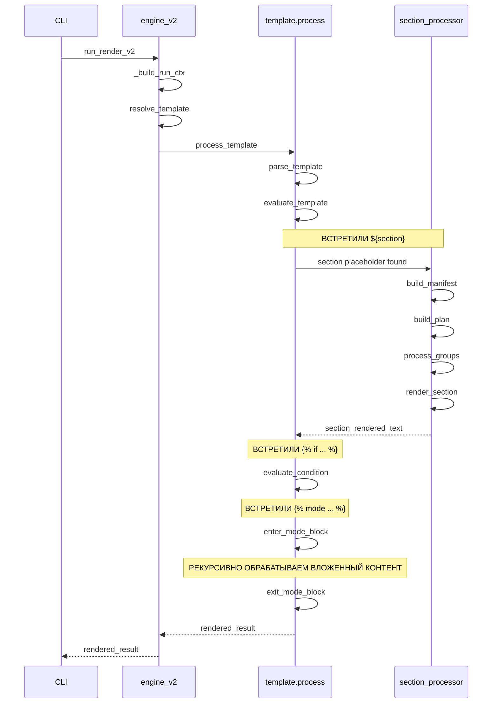

# LG V2 и новый движок шаблонизации

Анализируя требования по необходимости реализации новых блоков в шаблонах: условных и режимов, учитывая уже существующую логику прейсхолдеров с рекурсивными инклудами и предвосхищая новые потенциальные требования, связанные с системой шаблонов — я пришел к выводу о том, что нам необходимо разработать новый движок шаблонов и полностью переработать центральную часть пайплайна LG, которая будет использовать новую подсистему шаблонов. По сути это означает глобальный выпуск мажорной версии LG V2.

## Мы отказываемся от

1. Старый модуль `lg/context/`. Он не перспективен, основан на простой подстановке плейсхолдеров (`${section_name}`) и не поддерживает условные блоки или переопределение режимов. 

2. Центральная часть пайплайна в `lg/engine.py`.

```
resolve_context  → build_manifest → build_plan → process_groups → render_by_section → compose_context 
```

Основная проблема в том, что обработка шаблонов сейчас происходит в двух отдельных фазах:

- В `resolve_context` - собираются ссылки на секции из плейсхолдеров
- В `compose_context` - выполняется подстановка уже отрендеренных секций

А между этими фазами выполняется вся тяжелая работа по обработке файлов.

3. Старая система IR-классов в `lg/types.py`. Так как мы собираемся значительно переработать пайплайн, то от старой декларации IR-модели лучше тоже сразу отказаться и начать разработку более чистой подходящей версии.


## Что мы планируем на замену

### Новый единый движок шаблонизации

#### Общая структура движка шаблонизации

Мы создадим новый модуль `lg/template/` со следующими компонентами:

```
lg/template/
  ├─ nodes.py           # Определения AST-узлов шаблона
  ├─ lexer.py           # Лексический анализатор для шаблонов
  ├─ parser.py          # Построение AST из токенов
  ├─ evaluator.py       # Вычисление условий и режимов
  ├─ context.py         # Контекст рендеринга шаблона
  ├─ errors.py          # Классы ошибок и обработка исключений
  └─ processor.py       # API для движка шаблонизации
```

#### Новая структура AST для шаблонов

```python
@dataclass
class TemplateNode:
    """Базовый класс для всех узлов AST шаблона."""
    pass

@dataclass
class TextNode(TemplateNode):
    """Обычный текстовый контент."""
    text: str

@dataclass
class SectionNode(TemplateNode):
    """Плейсхолдер секции ${section}."""
    section_name: str
    # Метаданные для резолвинга
    resolved_ref: Optional[SectionRef] = None

@dataclass
class IncludeNode(TemplateNode):
    """Плейсхолдер для включения шаблона ${tpl:name} или ${ctx:name}."""
    kind: str  # "tpl" или "ctx"
    name: str
    origin: str  # "self" или путь
    # Для хранения вложенного AST после резолвинга
    children: List[TemplateNode] = field(default_factory=list)

@dataclass
class ConditionalBlockNode(TemplateNode):
    """Блок ...."""
    condition_text: str  # Исходный текст условия
    condition_ast: Optional[Condition] = None  # AST условия после парсинга
    body: List[TemplateNode] = field(default_factory=list)
    evaluated: Optional[bool] = None  # Результат после вычисления

@dataclass
class ElseNode(TemplateNode):
    """Обработка  внутри условных блоков."""
    body: List[TemplateNode] = field(default_factory=list)

@dataclass
class ModeBlockNode(TemplateNode):
    """Блок ...."""
    modeset: str
    mode: str
    body: List[TemplateNode] = field(default_factory=list)
    original_mode_options: Optional[ModeOptions] = None  # Сохраненный контекст перед блоком
    original_active_tags: Optional[Set[str]] = None  # Сохраненный контекст перед блоком

@dataclass
class CommentNode(TemplateNode):
    """Блок {# комментарий #}, который игнорируется при рендеринге."""
    text: str
```

Также нужно детализировать структуру лексера и парсера:

```python
# lg/template/lexer.py
class TokenType(enum.Enum):
    TEXT = "TEXT"
    PLACEHOLDER_START = "PLACEHOLDER_START"  # ${
    PLACEHOLDER_END = "PLACEHOLDER_END"      # }
    DIRECTIVE_START = "DIRECTIVE_START"      # 
    COMMENT_START = "COMMENT_START"          # {#
    COMMENT_END = "COMMENT_END"              # #}
    IDENTIFIER = "IDENTIFIER"
    COLON = "COLON"
    AND = "AND"
    OR = "OR"
    NOT = "NOT"
    # ... другие токены

@dataclass
class Token:
    type: TokenType
    value: str
    position: int
    line: int
    column: int  # Для точной диагностики ошибок
```

#### Диаграмма классов для нового движка шаблонизации


### Новая версия центрального пайплайна обработки LG V2

На замену старому `lg/engine.py` должен быть написан новый `lg/engine_v2.py`, который позволяет делать однопроходную работу с движком шаблонов.

По сути вместо того, чтобы 2 раза дергать систему шаблонизации (как в старой версии)? `lg/engine_v2.py` из `lg/template/process.py` вызывает один метод и ему передает один или несколько заранее сформированных хендлеров, которые инкапсулируют логику цепочки: build_manifest → build_plan → process_groups → render_by_section.

Таким образом, не умея самостоятельно производить фильтрацию файлов, работать с VCS, языковыми адаптерами и рендерить итоговые секции в fanced-блоки, шаблонизатор через хендлер (один или несколько) все равно получает возможность выполнить эти задачи. Это сокращает необходимость в объёмной промежуточной IR-модели.



#### Новый RunContext для отслеживания режимов и тегов

Скорее всего в новой версии LG V2 также необходимо будет скорректировать `RunContext`, так как сейчас в старом варианте это глобальный объект, который проходит через весь пайплайн как иммутабельный синглтон.

Когда в шаблоне встречается блок вида `...`, нам нужно:
1. Временно изменить режимы и активные теги
2. Обработать содержимое блока с этими измененными настройками
3. Вернуть исходные режимы и теги после блока

Вместо изменения самого `RunContext`, правильное решение:

1. **Создать локальный контекст для шаблонизатора**:
   ```python
   @dataclass
   class TemplateContext:
       # Ссылка на глобальный контекст
       run_ctx: RunContext
       # Локальные переопределения
       current_options: ModeOptions
       active_tags: Set[str]
       active_modes: Set[str]
       # Стек сохраненных состояний для вложенных блоков
       saved_states: List[Tuple[ModeOptions, Set[str]]] = field(default_factory=list)
   ```

2. **Реализовать методы для работы с режимами**:
   ```python
   def enter_mode_block(self, modeset: str, mode: str) -> None:
       # Сохраняем текущее состояние в стек
       self.saved_states.append((
           self.current_options,
           self.active_tags
       ))
       
       # Применяем новый режим и обновляем теги
       new_options = self.run_ctx.adaptive_loader.get_mode_options(modeset, mode)
       new_tags = self.run_ctx.adaptive_loader.get_tags_for_mode(modeset, mode)
       
       # Создаем новые копии, чтобы избежать мутирования
       self.current_options = ModeOptions.merge(self.current_options, new_options)
       self.active_tags = self.active_tags.union(new_tags)
       
   def exit_mode_block(self) -> None:
       # Восстанавливаем предыдущее состояние из стека
       if self.saved_states:
           self.current_options, self.active_tags = self.saved_states.pop()
   ```

3. **Использовать этот контекст при обработке AST шаблона**:
   ```python
   def evaluate_template(ast: List[TemplateNode], template_ctx: TemplateRenderingContext) -> str:
       result = []
       for node in ast:
           if isinstance(node, ModeBlockNode):
               template_ctx.enter_mode_block(node.modeset, node.mode)
               result.append(evaluate_template(node.body, template_ctx))
               template_ctx.exit_mode_block()
           # Обработка других типов узлов...
       return "".join(result)
   ```

#### Управление кэшем в динамическом контексте

В новой модели важно правильно кэшировать результаты с учетом активных режимов:

```python
def compute_section_cache_key(section_name: str, ctx: TemplateRenderingContext) -> str:
    """Формирует ключ кэша для секции с учетом режимов и тегов."""
    mode_fingerprint = hashlib.sha1()
    
    # Добавляем базовую информацию
    mode_fingerprint.update(section_name.encode('utf-8'))
    
    # Добавляем информацию о режимах
    for modeset, mode in ctx.active_modes.items():
        mode_fingerprint.update(f"{modeset}:{mode}".encode('utf-8'))
    
    # Добавляем активные теги
    for tag in sorted(ctx.current_active_tags):
        mode_fingerprint.update(tag.encode('utf-8'))
    
    return mode_fingerprint.hexdigest()
```


## Что делаем сейчас

Ничего пока делать не нужно. Просто подтверди, что ты дочитал досюда.