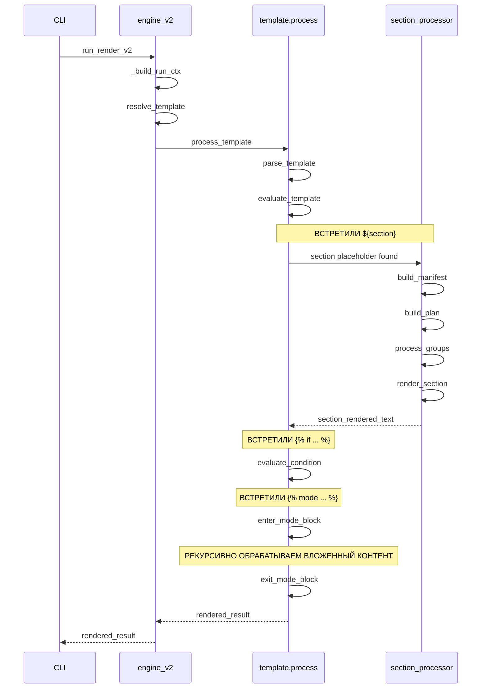
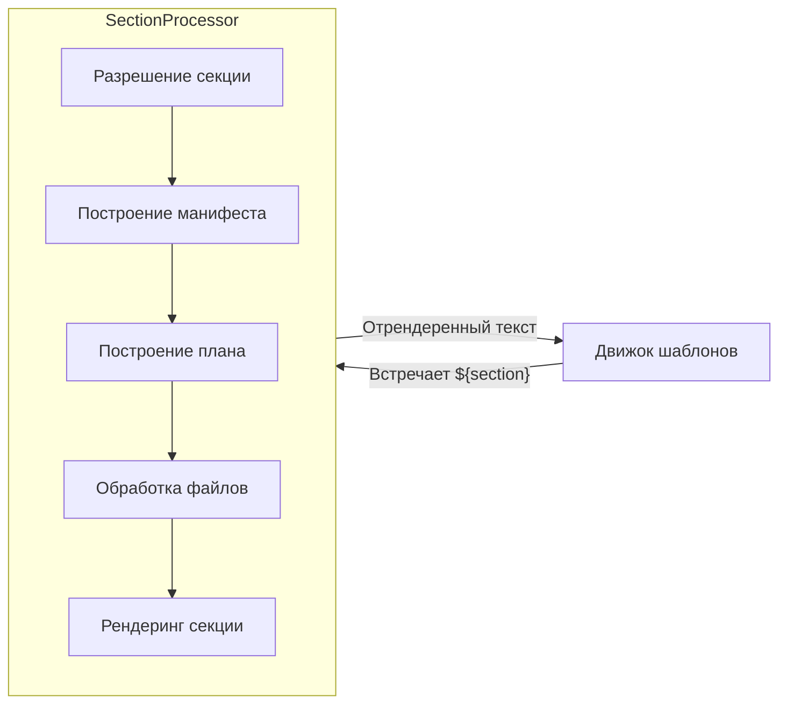
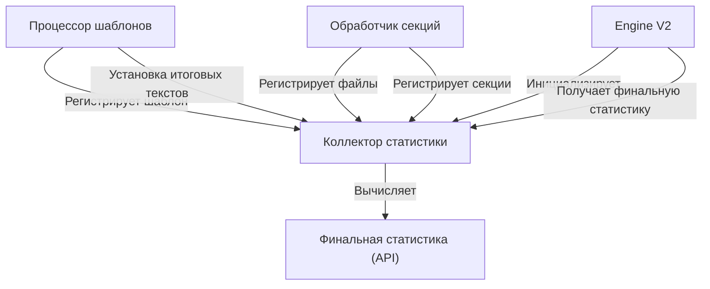

# LG V2 и новый движок шаблонизации

Анализируя требования по необходимости реализации новых блоков в шаблонах: условных и режимов, учитывая уже существующую логику прейсхолдеров с рекурсивными инклудами и предвосхищая новые потенциальные требования, связанные с системой шаблонов — я пришел к выводу о том, что нам необходимо разработать новый движок шаблонов и полностью переработать центральную часть пайплайна LG, которая будет использовать новую подсистему шаблонов. По сути это означает глобальный выпуск мажорной версии LG V2.

## Мы отказываемся от

1. Старый модуль `lg/context/`. Он не перспективен, основан на простой подстановке плейсхолдеров (`${section_name}`) и не поддерживает условные блоки или переопределение режимов. 

2. Центральная часть пайплайна в `lg/engine.py`.

```
resolve_context  → build_manifest → build_plan → process_groups → render_by_section → compose_context 
```

Основная проблема в том, что обработка шаблонов сейчас происходит в двух отдельных фазах:

- В `resolve_context` - собираются ссылки на секции из плейсхолдеров
- В `compose_context` - выполняется подстановка уже отрендеренных секций

А между этими фазами выполняется вся тяжелая работа по обработке файлов.

3. Старая система IR-классов в `lg/types.py`. Так как мы собираемся значительно переработать пайплайн, то от старой декларации IR-модели лучше тоже сразу отказаться и начать разработку более чистой подходящей версии.

4. Старая система статистики в `lg/stats/report.py`.

## Что мы планируем на замену

- **Новый единый движок шаблонизации**
- **Новая версия центрального пайплайна обработки LG V2**
- **Новая последовательность обработки секций**
- **Новая конфигурация и модель для адаптивных возможностей**
- **Новая IR-модель**
- **Новая инкрементальная система статистики**

## Новый единый движок шаблонизации

### Общая структура движка шаблонизации

Мы создадим новый модуль `lg/template/` со следующими компонентами:

```
lg/template/
  ├─ nodes.py           # Определения AST-узлов шаблона
  ├─ lexer.py           # Лексический анализатор для шаблонов
  ├─ parser.py          # Построение AST из токенов
  ├─ evaluator.py       # Вычисление условий и режимов
  ├─ context.py         # Контекст рендеринга шаблона
  ├─ errors.py          # Классы ошибок и обработка исключений
  └─ processor.py       # API для движка шаблонизации
```

### Новая структура AST для шаблонов

```python
@dataclass
class TemplateNode:
    """Базовый класс для всех узлов AST шаблона."""
    pass

@dataclass
class TextNode(TemplateNode):
    """Обычный текстовый контент."""
    text: str

@dataclass
class SectionNode(TemplateNode):
    """Плейсхолдер секции ${section}."""
    section_name: str
    # Метаданные для резолвинга
    resolved_ref: Optional[SectionRef] = None

@dataclass
class IncludeNode(TemplateNode):
    """Плейсхолдер для включения шаблона ${tpl:name} или ${ctx:name}."""
    kind: str  # "tpl" или "ctx"
    name: str
    origin: str  # "self" или путь
    # Для хранения вложенного AST после резолвинга
    children: List[TemplateNode] = field(default_factory=list)

@dataclass
class ConditionalBlockNode(TemplateNode):
    """Блок ...."""
    condition_text: str  # Исходный текст условия
    condition_ast: Optional[Condition] = None  # AST условия после парсинга
    body: List[TemplateNode] = field(default_factory=list)
    evaluated: Optional[bool] = None  # Результат после вычисления

@dataclass
class ElseNode(TemplateNode):
    """Обработка  внутри условных блоков."""
    body: List[TemplateNode] = field(default_factory=list)

@dataclass
class ModeBlockNode(TemplateNode):
    """Блок ...."""
    modeset: str
    mode: str
    body: List[TemplateNode] = field(default_factory=list)
    original_mode_options: Optional[ModeOptions] = None  # Сохраненный контекст перед блоком
    original_active_tags: Optional[Set[str]] = None  # Сохраненный контекст перед блоком

@dataclass
class CommentNode(TemplateNode):
    """Блок {# комментарий #}, который игнорируется при рендеринге."""
    text: str
```

Также нужно детализировать структуру лексера и парсера:

```python
# lg/template/lexer.py
class TokenType(enum.Enum):
    TEXT = "TEXT"
    PLACEHOLDER_START = "PLACEHOLDER_START"  # ${
    PLACEHOLDER_END = "PLACEHOLDER_END"      # }
    DIRECTIVE_START = "DIRECTIVE_START"      # 
    COMMENT_START = "COMMENT_START"          # {#
    COMMENT_END = "COMMENT_END"              # #}
    IDENTIFIER = "IDENTIFIER"
    COLON = "COLON"
    AND = "AND"
    OR = "OR"
    NOT = "NOT"
    # ... другие токены

@dataclass
class Token:
    type: TokenType
    value: str
    position: int
    line: int
    column: int  # Для точной диагностики ошибок
```

### Диаграмма классов для нового движка шаблонизации


## Новая версия центрального пайплайна обработки LG V2

На замену старому `lg/engine.py` должен быть написан новый `lg/engine_v2.py`, который позволяет делать однопроходную работу с движком шаблонов.

По сути вместо того, чтобы 2 раза дергать систему шаблонизации (как в старой версии)? `lg/engine_v2.py` из `lg/template/process.py` вызывает один метод и ему передает один или несколько заранее сформированных хендлеров, которые инкапсулируют логику цепочки: build_manifest → build_plan → process_groups → render_by_section.

Таким образом, не умея самостоятельно производить фильтрацию файлов, работать с VCS, языковыми адаптерами и рендерить итоговые секции в fanced-блоки, шаблонизатор через хендлер (один или несколько) все равно получает возможность выполнить эти задачи. Это сокращает необходимость в объёмной промежуточной IR-модели.



## Новая последовательность обработки секций

Переход к архитектуре, основанной на шаблонах, в LG V2 требует переосмысления обработки секций. Вместо пакетной обработки всех секций сразу нам нужен обработчик по запросу, который обрабатывает секции индивидуально по мере их встречи в шаблонах.

### Основной дизайн обработчика секций

Компонент обработчика секций будет выполнять полный цикл обработки одной секции по запросу от движка шаблонов:



### Конфигурация и модель для адаптивных возможностей

Данный системы уже реализованы и располагаются в:
- `lg/config/adaptive_model.py`
- `lg/config/adaptive_loader.py`

Например, довольно полезна концепция нового класса `ModeOptions`, которая позволяет типизировать активные сейчас технические опции. Сюда же необходимо перенести `code_fence`.

Новая IR-модель учитывает и дополняет то, что уже реализовано в `lg/config/adaptive_model.py`.

### Новая IR модель для обработки секций

Вот предлагаемая IR модель для обработчика секций по запросу:

```python
# lg/types_v2.py

from __future__ import annotations
from dataclasses import dataclass, field
from pathlib import Path
from typing import Dict, List, Literal, Optional, Set, Any

# Базовые типы
PathLabelMode = Literal["auto", "relative", "basename", "off"]
LangName = str  # "python", "markdown", "", и т.д.
LANG_NONE: LangName = ""

@dataclass(frozen=True)
class SectionRef:
    """Ссылка на секцию с информацией о разрешении."""
    name: str         # Имя секции, используемое в шаблоне
    scope_path: str   # Путь к директории области (относительно корня репозитория)
    cfg_path: Path    # Абсолютный путь к директории конфигурации
    
    def canon_key(self) -> str: # В однопроходной системе каноничный стабильный ключ уже не сильно нужен, но пусть на всякий случай будет
        """Возвращает канонический ключ для этой секции."""
        scope = self.scope_path or "."
        return f"{scope}::{self.name}"

@dataclass(frozen=True)
class FileEntry:
    """Представляет файл для включения в секцию."""
    abs_path: Path
    rel_path: str      # Относительно корня репозитория
    language_hint: LangName
    adapter_overrides: Dict[str, Dict] = field(default_factory=dict)

@dataclass
class SectionManifest:
    """Манифест одной секции со всеми её файлами."""
    ref: SectionRef
    files: List[FileEntry]
    # code_fence: bool — этого поля теперь нет, достается из TemplateContext.current_mode_options (ModeOptions)
    path_labels: PathLabelMode
    adapters_cfg: Dict[str, Dict] = field(default_factory=dict)

@dataclass
class FileGroup:
    """Группа файлов с одинаковым языком."""
    lang: LangName
    entries: List[FileEntry]
    mixed: bool = False

@dataclass
class SectionPlan:
    """План для рендеринга одной секции."""
    manifest: SectionManifest
    groups: List[FileGroup]
    md_only: bool
    labels: Dict[str, str] = field(default_factory=dict)  # rel_path -> отображаемая метка

@dataclass(frozen=True)
class ProcessedFile:
    """Обработанный файл, готовый для рендеринга."""
    abs_path: Path
    rel_path: str
    processed_text: str
    meta: Dict[str, Any]
    raw_text: str
    cache_key: str

@dataclass
class RenderedSection:
    """Финальная отрендеренная секция."""
    ref: SectionRef
    text: str
    files: List[ProcessedFile]
    meta_summary: Dict[str, int] = field(default_factory=dict)
```

### Реализация обработчика секций

```python
# lg/section_processor.py

from __future__ import annotations

from pathlib import Path
from typing import Dict, List, Optional, Set

from .types_v2 import SectionRef, SectionManifest, SectionPlan, ProcessedFile, RenderedSection
from .run_context import RunContext
from .template.context import TemplateContext
from .cache.fs_cache import Cache

class SectionProcessor:
    """
    Обрабатывает одну секцию по запросу.
    Это заменяет части старой цепочки build_manifest -> build_plan -> process_groups -> render_by_section,
    но для одной секции за раз.
    """
    
    def __init__(self, run_ctx: RunContext):
        self.run_ctx = run_ctx
        self.cache = run_ctx.cache
        self.vcs = run_ctx.vcs
        self.section_cache: Dict[str, RenderedSection] = {}
    
    def process_section(self, section_name: str, template_ctx: TemplateContext) -> RenderedSection:
        """
        Обрабатывает одну секцию и возвращает её отрендеренное содержимое.
        
        Args:
            section_name: Имя секции для обработки
            template_ctx: Текущий контекст шаблона (содержит активные режимы, теги)
            
        Returns:
            Отрендеренная секция
        """
        # Сначала проверяем кэш
        cache_key = self._compute_cache_key(section_name, template_ctx)
        if cache_key in self.section_cache:
            return self.section_cache[cache_key]
        
        # Обрабатываем секцию через конвейер
        section_ref = self._resolve_section_ref(section_name, template_ctx)
        manifest = self._build_section_manifest(section_ref, template_ctx)
        plan = self._build_section_plan(manifest, template_ctx)
        processed_files = self._process_files(plan, template_ctx)
        rendered = self._render_section(plan, processed_files, template_ctx)
        
        # Кэшируем результат
        self.section_cache[cache_key] = rendered
        
        return rendered
    
    def _compute_cache_key(self, section_name: str, template_ctx: TemplateContext) -> str:
        """
        Вычисляет ключ кэша для секции на основе:
        - Имени секции
        - Активных режимов
        - Активных тегов
        - Режима VCS (all vs changes)
        """
        # Детали реализации
        pass
    
    # Другие методы реализации
    # ...
```

### Ключевые отличия от старого конвейера

1. **Обработка по запросу**: Секции обрабатываются индивидуально при встрече в шаблонах

2. **Контекстно-зависимая обработка**: Включаемые файлы зависят от активных режимов и тегов

3. **Динамическое кэширование**: Ключи кэша включают активные режимы/теги для корректного повторного использования

4. **Детальная фильтрация файлов**: Фильтрация файлов на основе активных условий

### Интеграция с движком шаблонов

Обработчик секций интегрируется с движком шаблонов следующим образом:

```python
class TemplateProcessor:
    def __init__(self, run_ctx: RunContext):
        self.run_ctx = run_ctx
        self.section_processor = SectionProcessor(run_ctx)
        self.template_ctx = TemplateContext(run_ctx)
        
    def process_template(self, template_text: str) -> str:
        """Обрабатывает шаблон и возвращает отрендеренный результат."""
        ast = self.parse_template(template_text)
        return self.evaluate_template(ast)
        
    def evaluate_template(self, ast: List[TemplateNode]) -> str:
        result = []
        for node in ast:
            if isinstance(node, SectionNode):
                # Здесь вызывается обработчик секций
                section = self.section_processor.process_section(
                    node.section_name, 
                    self.template_ctx
                )
                result.append(section.text)
            elif isinstance(node, ConditionalBlockNode):
                if self.evaluate_condition(node.condition_ast):
                    result.append(self.evaluate_template(node.body))
                elif node.else_block:
                    result.append(self.evaluate_template(node.else_block.body))
            elif isinstance(node, ModeBlockNode):
                self.template_ctx.enter_mode_block(node.modeset, node.mode)
                result.append(self.evaluate_template(node.body))
                self.template_ctx.exit_mode_block()
            # Обработка других типов узлов...
        return "".join(result)
```

### Контекст шаблона для управления состоянием

Контекст шаблона поддерживает состояние, необходимое во время обработки шаблона:

```python
@dataclass
class TemplateContext:
    """Контекст для рендеринга шаблона с управлением состоянием."""
    run_ctx: RunContext
    # Локальные переопределения
    current_mode_options: ModeOptions
    active_tags: Set[str]
    active_modes: Dict[str, str]  # modeset -> mode
    # Стек для вложенных блоков режимов
    saved_states: List[Tuple[ModeOptions, Set[str], Dict[str, str]]] = field(default_factory=list)
    
    def enter_mode_block(self, modeset: str, mode: str) -> None:
        """Сохраняет текущее состояние и применяет новый режим."""
        # Сохраняем текущее состояние
        self.saved_states.append((
            self.current_mode_options,
            set(self.active_tags),
            dict(self.active_modes)
        ))
        
        # Применяем новый режим
        self.active_modes[modeset] = mode
        mode_info = self.run_ctx.adaptive_loader.get_mode_info(modeset, mode)
        if mode_info:
            # Обновляем теги
            self.active_tags.update(mode_info.tags)
            # Обновляем опции режима
            self.current_mode_options = ModeOptions.merge(
                self.current_mode_options, 
                mode_info.options
            )
    
    def exit_mode_block(self) -> None:
        """Восстанавливает предыдущее состояние."""
        if self.saved_states:
            self.current_mode_options, self.active_tags, self.active_modes = self.saved_states.pop()
```

### Условная фильтрация файлов

Ключевое нововведение в этом дизайне — условная фильтрация файлов на основе активного контекста:

```python
def _filter_files_by_conditions(
    self, 
    files: List[FileEntry], 
    filters: Dict[str, Any], 
    template_ctx: TemplateContext
) -> List[FileEntry]:
    """Фильтрует файлы на основе условных правил из конфигурации."""
    result = list(files)  # Начинаем со всех файлов
    
    # Применяем условные фильтры
    if "when" in filters:
        for condition_rule in filters["when"]:
            condition = condition_rule.get("condition")
            if not condition:
                continue
                
            # Оцениваем условие с текущим контекстом
            is_match = self._evaluate_condition(condition, template_ctx)
            if is_match:
                # Применяем правила allow/block из этого условия
                if "allow" in condition_rule:
                    # Добавляем файлы, соответствующие шаблонам allow
                    pass
                if "block" in condition_rule:
                    # Удаляем файлы, соответствующие шаблонам block
                    pass
    
    return result
```

### Управление кэшем

Система кэширования должна быть обновлена для учета активного контекста шаблона:

```python
def _compute_section_cache_key(self, section_ref: SectionRef, template_ctx: TemplateContext) -> str:
    """Вычисляет ключ кэша, включая активные режимы и теги."""
    key_parts = [
        section_ref.canon_key(),
        template_ctx.current_mode_options.vcs_mode,
    ]
    
    # Добавляем активные режимы
    for modeset, mode in sorted(template_ctx.active_modes.items()):
        key_parts.append(f"mode:{modeset}:{mode}")
    
    # Добавляем активные теги
    for tag in sorted(template_ctx.active_tags):
        key_parts.append(f"tag:{tag}")
        
    return hashlib.sha256(":".join(key_parts).encode()).hexdigest()
```
## Адаптация системы статистики для архитектуры LG V2

Система статистики - один из ключевых компонентов Listing Generator, который нужно аккуратно переработать для новой архитектуры V2. Вместо постобработки статистики после завершения пайплайна, в новой архитектуре нам нужно собирать метрики инкрементально в процессе рендеринга.

### Основные изменения в подходе к сбору статистики

В текущей архитектуре статистика собирается одним большим вызовом `compute_stats()` после того, как весь пайплайн завершён:

```python
def compute_stats(
    *,
    blobs: List[ProcessedBlob],
    rendered_final_text: str,
    rendered_sections_only_text: str,
    templates_hashes: Dict[str, str],
    spec: ContextSpec,
    manifest: Manifest,
    tokenizer: TokenService,
    code_fence: bool,
    cache: Cache,
) -> Tuple[List[FileRow], Totals, ContextBlock]:
    # ...
```

В новой архитектуре V2 нам нужно:

1. Собирать статистику постепенно, по мере обработки файлов и секций
2. Учитывать динамически изменяющийся контекст (режимы, теги)
3. Корректно обрабатывать условные блоки
4. Отслеживать переопределения режимов через `` блоки

### Новая модель сбора статистики

#### Коллектор статистики

```python
class StatsCollector:
    """
    Коллектор статистики, встроенный в процесс рендеринга шаблонов.
    
    Собирает метрики инкрементально, по мере обработки шаблонов и секций.
    """
    
    def __init__(self, run_ctx: RunContext):
        self.run_ctx = run_ctx
        self.tokenizer = run_ctx.tokenizer
        self.cache = run_ctx.cache
        self.model_info = self.tokenizer.model_info
        
        # Статистика по файлам (ключ: rel_path)
        self.files_stats: Dict[str, FileStats] = {}
        
        # Статистика по секциям (ключ: canon_key)
        self.sections_stats: Dict[str, SectionStats] = {}
        
        # Статистика по шаблонам (ключ: template_key)
        self.templates_stats: Dict[str, TemplateStats] = {}
        
        # Итоговый текст и связанные метрики
        self.final_text: Optional[str] = None
        self.sections_only_text: Optional[str] = None
        
        # Карта использования секций {canon_key: count}
        self.sections_usage: Dict[str, int] = {}
        
    def register_processed_file(self, file: ProcessedFile, section_ref: SectionRef, multiplicity: int = 1) -> None:
        """Регистрирует статистику обработанного файла."""
        rel_path = file.rel_path
        
        # Получаем или подсчитываем токены
        t_proc = self._get_or_count_tokens(
            file.cache_key, "processed", file.processed_text
        )
        
        t_raw = self._get_or_count_tokens(
            file.cache_key, "raw", file.raw_text
        )
        
        # Статистика файла с учетом множественности
        saved_tokens = max(0, (t_raw - t_proc) * multiplicity)
        saved_pct = (1 - (t_proc / t_raw)) * 100.0 if t_raw else 0.0
        
        # Регистрируем или обновляем статистику файла
        if rel_path not in self.files_stats:
            self.files_stats[rel_path] = FileStats(
                path=rel_path,
                size_bytes=file.size_bytes,
                tokens_raw=t_raw * multiplicity,
                tokens_processed=t_proc * multiplicity,
                saved_tokens=saved_tokens,
                saved_pct=saved_pct,
                meta=file.meta,
                sections={section_ref.canon_key(): multiplicity}
            )
        else:
            # Файл уже учтен, обновляем статистику использования
            stats = self.files_stats[rel_path]
            canon_key = section_ref.canon_key()
            stats.sections[canon_key] = stats.sections.get(canon_key, 0) + multiplicity
        
        # Обновляем счетчик использования секции
        self.sections_usage[section_ref.canon_key()] = self.sections_usage.get(
            section_ref.canon_key(), 0
        ) + multiplicity
    
    def register_section_rendered(self, section: RenderedSection) -> None:
        """Регистрирует статистику отрендеренной секции."""
        canon_key = section.ref.canon_key()
        
        # Собираем метаданные со всех файлов
        meta_summary = {}
        for file in section.files:
            for k, v in self._extract_numeric_meta(file.meta).items():
                meta_summary[k] = meta_summary.get(k, 0) + v
        
        # Регистрируем статистику секции
        self.sections_stats[canon_key] = SectionStats(
            ref=section.ref,
            text=section.text,
            tokens_processed=section.tokens_processed,
            tokens_raw=section.tokens_raw,
            total_size_bytes=section.total_size_bytes,
            meta_summary=meta_summary
        )
    
    def set_final_texts(self, final_text: str, sections_only_text: str) -> None:
        """Устанавливает итоговые тексты для подсчета токенов."""
        self.final_text = final_text
        self.sections_only_text = sections_only_text
    
    def register_template(self, template_key: str, template_text: str) -> None:
        """Регистрирует статистику шаблона."""
        # Подсчитываем токены в шаблоне
        tokens = self.tokenizer.count_text(template_text)
        
        self.templates_stats[template_key] = TemplateStats(
            key=template_key,
            tokens=tokens,
            text_size=len(template_text)
        )
    
    def compute_final_stats(self) -> Tuple[List[FileRow], Totals, ContextBlock]:
        """
        Вычисляет итоговую статистику на основе собранных данных.
        
        Возвращает структуру, аналогичную старой compute_stats():
        - список статистики по файлам
        - общую статистику
        - статистику контекста
        """
        # Проверяем наличие необходимых данных
        if not self.final_text:
            raise ValueError("Final text not set. Call set_final_texts() before computing stats.")
        
        # Вычисляем общие суммы
        total_raw = sum(f.tokens_raw for f in self.files_stats.values())
        total_proc = sum(f.tokens_processed for f in self.files_stats.values())
        total_size = sum(f.size_bytes for f in self.files_stats.values())
        
        # Подсчитываем токены в итоговом тексте
        t_final = self._get_or_count_tokens("final_text", "rendered", self.final_text)
        t_sections_only = self._get_or_count_tokens("sections_only", "rendered", self.sections_only_text)
        
        # Преобразуем статистику файлов в формат API
        files_rows = []
        for file_stats in sorted(self.files_stats.values(), key=lambda x: x.path):
            prompt_share = (file_stats.tokens_processed / total_proc * 100.0) if total_proc else 0.0
            ctx_share = (file_stats.tokens_processed / self.model_info.ctx_limit * 100.0) if self.model_info.ctx_limit else 0.0
            
            files_rows.append(FileRow(
                path=file_stats.path,
                sizeBytes=file_stats.size_bytes,
                tokensRaw=file_stats.tokens_raw,
                tokensProcessed=file_stats.tokens_processed,
                savedTokens=file_stats.saved_tokens,
                savedPct=file_stats.saved_pct,
                promptShare=prompt_share,
                ctxShare=ctx_share,
                meta=file_stats.meta or {}
            ))
        
        # Создаем итоговую статистику
        totals = Totals(
            sizeBytes=total_size,
            tokensProcessed=total_proc,
            tokensRaw=total_raw,
            savedTokens=max(0, total_raw - total_proc),
            savedPct=(1 - (total_proc / total_raw)) * 100.0 if total_raw else 0.0,
            ctxShare=(total_proc / self.model_info.ctx_limit * 100.0) if self.model_info.ctx_limit else 0.0,
            renderedTokens=t_sections_only,
            renderedOverheadTokens=max(0, t_sections_only - total_proc)
        )
        
        # Создаем статистику контекста
        ctx_block = ContextBlock(
            templateName=self.run_ctx.target_spec.name,
            sectionsUsed=self.sections_usage,
            finalRenderedTokens=t_final,
            templateOnlyTokens=max(0, t_final - t_sections_only),
            templateOverheadPct=((t_final - t_sections_only) / t_final * 100.0) if t_final else 0.0,
            finalCtxShare=(t_final / self.model_info.ctx_limit * 100.0) if self.model_info.ctx_limit else 0.0
        )
        
        return files_rows, totals, ctx_block
    
    def _get_or_count_tokens(self, key: str, mode: str, text: str) -> int:
        """Получает токены из кэша или подсчитывает их и сохраняет."""
        # Реализация работы с кэшем...
        return self.tokenizer.count_text(text)
    
    def _extract_numeric_meta(self, meta: Dict) -> Dict[str, int]:
        """Извлекает числовые метаданные."""
        out: Dict[str, int] = {}
        for k, v in (meta or {}).items():
            try:
                if isinstance(v, bool):
                    v = int(v)
                if isinstance(v, (int, float)):
                    out[k] = out.get(k, 0) + int(v)
            except Exception:
                pass
        return out
```

#### Необходимые дополнения в IR-модели

```python
@dataclass
class FileStats:
    """Статистика по файлу."""
    path: str
    size_bytes: int
    tokens_raw: int
    tokens_processed: int
    saved_tokens: int
    saved_pct: float
    meta: Dict[str, Any]
    sections: Dict[str, int] = field(default_factory=dict)  # секция -> количество использований

@dataclass
class SectionStats:
    """Статистика по отрендеренной секции."""
    ref: SectionRef
    text: str
    tokens_processed: int
    tokens_raw: int
    total_size_bytes: int
    meta_summary: Dict[str, int] = field(default_factory=dict)

@dataclass
class TemplateStats:
    """Статистика по шаблону."""
    key: str
    tokens: int
    text_size: int
```

#### Интеграция с движком шаблонов

```python
class TemplateProcessor:
    def __init__(self, run_ctx: RunContext):
        self.run_ctx = run_ctx
        self.section_processor = SectionProcessor(run_ctx)
        self.template_ctx = TemplateContext(run_ctx)
        self.stats_collector = StatsCollector(run_ctx)
        
    def process_template(self, template_text: str, template_key: str) -> str:
        """Обрабатывает шаблон и собирает статистику."""
        # Регистрируем шаблон
        self.stats_collector.register_template(template_key, template_text)
        
        # Обрабатываем шаблон
        ast = self.parse_template(template_text)
        rendered_text = self.evaluate_template(ast)
        
        # Собираем статистику по секциям без шаблонного "клея"
        sections_only_text = self._collect_sections_only_text(ast)
        self.stats_collector.set_final_texts(rendered_text, sections_only_text)
        
        return rendered_text
        
    def evaluate_template(self, ast: List[TemplateNode]) -> str:
        # Оценка шаблона с интегрированным сбором статистики
        # ...
```

#### Интеграция с обработчиком секций

```python
class SectionProcessor:
    def __init__(self, run_ctx: RunContext):
        self.run_ctx = run_ctx
        # ...
    
    def process_section(self, section_name: str, template_ctx: TemplateContext) -> RenderedSection:
        """Обрабатывает секцию и регистрирует статистику."""
        # Обработка секции...
        
        # После обработки всех файлов и рендеринга секции
        for processed_file in processed_files:
            template_ctx.stats_collector.register_processed_file(
                processed_file, 
                section_ref,
                multiplicity=1  # или актуальная кратность
            )
        
        # Регистрируем итоговую секцию
        template_ctx.stats_collector.register_section_rendered(rendered_section)
        
        return rendered_section
```

### Основные улучшения и отличия от текущей реализации

1. **Инкрементальный сбор**: Статистика собирается постепенно в процессе рендеринга, а не как отдельный шаг.

2. **Контекстно-зависимый сбор**: Учитывает активные режимы и теги в момент обработки каждой секции.

3. **Учет условий**: Правильно обрабатывает условные блоки, собирая статистику только для включенного контента.

4. **Режимные блоки**: Корректно отслеживает изменения контекста внутри `` блоков.

5. **Интеграция с кэшем**: Сохраняет совместимость с системой кэширования токенов.

6. **Совместимый вывод**: Несмотря на изменение внутренней архитектуры, выдаёт результат в том же формате, что и текущая реализация.

### Диаграмма интеграции



Такая архитектура сбора статистики сохраняет все функциональные возможности текущей реализации, но при этом полностью интегрирована с новым однопроходным подходом к обработке шаблонов в LG V2.